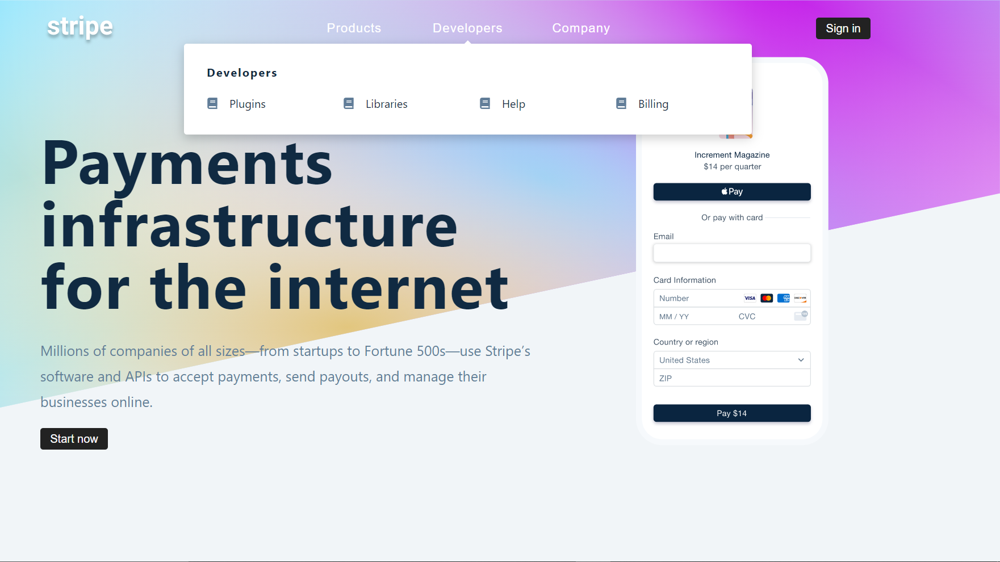

# Modern Navigation bar IN REACT
Site is live at:https://modern-navbar.netlify.app/

 

## ✨ Requirements

- Any Operating System (ie. MacOS X, Linux, Windows)
- Any IDE with installed (ie.Brackets , Atom, VSCode etc)
- A little knowledge of javascript, React and Reducers.

## 🚀 How to use it

- clone the project to your device.
- To install dependence open terminal and type npm install.
- After installation is complete type npm start in terminal
